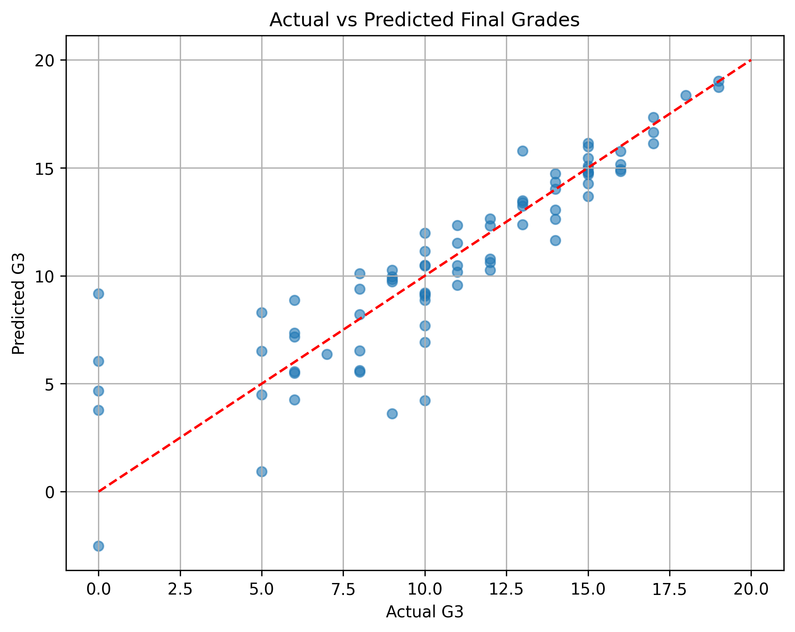

# 🎓 Student Performance ML

Predicting final math grades (`G3`) of students using exploratory data analysis and regression models built with TensorFlow.

## 📂 Project Overview

This project walks through:
- EDA on the UCI Student Performance dataset
- Feature engineering and preprocessing
- Training a feedforward neural network
- Evaluating model performance (MSE, R²)
- Saving the trained model

## 📊 Dataset

- Source: [UCI Student Performance Data](https://archive.ics.uci.edu/ml/datasets/Student+Performance)
- File used: `student-mat.csv`

## 🛠 Tools & Libraries

- Python, Pandas, Matplotlib, Seaborn
- Scikit-learn (preprocessing & evaluation)
- TensorFlow / Keras (regression model)

## 📈 Results

- Test MSE: ~4.54
- R² Score: ~0.78

### 📌 Example Output:

## 📁 Project Structure
